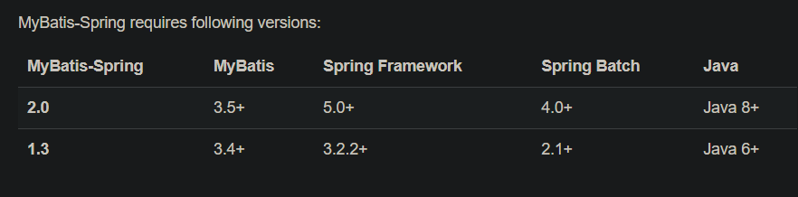

## 1-项目框架：SSM

    JDK版本：1.8.0_152
    maven:3.8.5
    tomcat:9.0.63
    编译环境IDEA 2022
    MySQL server 8.0
    navicat150_premium_cs_x64

## 项目框架简单说明：
    
    1、pom.xml是maven的配置文件，我们需要什么jar包，都可以在里面添加依赖
        ，然后maven就会自己帮我们下到本地仓库里面
    2、接下来就需要构思项目所需的文件结构：
        main下新建一个java,用来放java文件，
        src下新建一个test，用来放测试文件
        main下新建一个resources文件，
    3、src->main->java下新建package com，再新建xlh ，这两个对应我们刚开始的groupid
    4、xlh下新建四个包：controller用来存放前台url映射地址，
                     dao用来存放与数据库的接口文件
                     entity用来存放实体类文件
                     service用来存放自己定义的接口
                     interceptor；拦截器
                     test-java；junit单元测试
    5、配置文件:
        applicationContext.xml:是spring配置文件
        sqlmap文件里存放实体与数据库的映射文件
        generatorConfig.xml和generator.properties是mybatis的配置文件
        jdbc.properties是数据库相关信息
        log4j.properties是日志配置文件
        webapp下新建css、images、js等文件，用来存放前端资源
        web-inf下新建views文件夹，jsp文件就放在这里面

## 注意事项
     
    1、maven项目管理工具，如果我们不告诉他我们的代码要使用什么样的jdk版本编译的话，他就会用
       maven-compiler-plugin默认的jdk版本来进行处理，这样就容易出现版本不匹配，以至于导致编译不通过的问题
    2、maven在我电脑上默认使用的jdk为1.7，但是我使用的jdk版本为1.8
    3、由于是maven没指定编译版本引起的先在pom.xml指定编译版本，添加如下指定编译版本（一般情况下和所有jdk版本保持一致，如我这里是1.8）
   
   ```xml
     <properties>
     <maven.compiler.source>1.8</maven.compiler.source>
     <maven.compiler.target>1.8</maven.compiler.target>
     </properties>
   ```

## 依赖包的选择
    1、由于注入spring核心依赖较多，所以通过如下代码，统一spring依赖的版本

  ```xml
      <!-- spring版本号 -->
      <spring.version>5.2.22.RELEASE</spring.version>
      <!-- mybatis 版本号-->
  ```

    2、还需注意的是spring的.RELEASW为稳定版，所以一般选择该版本，并不是越新越好

### spring项目中每个jar包的作用
        
    1、commons-logging.jar
        记录程序运行时的活动日志记录
    2、spring-aop.jar
        在程序使用spring的AOP特性时需要的类，比如声明式事务管理
    3、spring-core.jar
        包含spring框架基本的核心工具类，spring的其他组件都需要使用这个包里的类
    4、spring-context.jar
        为spring核心提供大量的扩展，可以找到在使用spring applicationcontext特性时用到的所有的类
    5、spring-beans.jar
        访问配置文件，创建和管理bean以及进行控制反转依赖注入操作相关的类
    6、spring-experssion.jar
        spring表达式语言
    7、spring-web.jar
        这个jar文件包含web应用开发时，用到spring框架时所需要的核心类，包括自动载入
        webapplicationcontext 特性类，steuts与jsf集成类，文件上传的支持类，filter类和大量的工具辅助类
    8、spring-tx.jar
        为jdbc,hibernate,jdo,jpa等提供的一致的声明式和编程式事务管理
    9、aopalliance.jar
        包含了针对面向切面的一些接口
    10、aspectjrt.jar
        提供对sqpectj的支持，以便可以方便的将面向方面的功能集成进ide中
    11、spring-dao.jar
        这个jar文件包含Spring DAO,Spring Transcation进行数据访问的所有类
    12、spring-jdbc.jar
        这个jar文件包含对spring对JDBC数据访问进行封装的所有类
    13、spring-hibernate.jar
        这个jar文件包含spring对hibernate 2及hibernate 3进行封装的所有类
    14、spring-orm.jar
        这个jar文件包含spring对DAO特性集进行了扩展，使其支持iBATIS、JDO、OJB、TopLink,
        因为hibernate已经独立成包了，现在不包含在这个包里了。这个jar文件里大部分的类都要依赖
        spring-dao.jar里的类，用这个包时你需要同时包含spring-dao.jar包
    15、spring-remoting.jar
        这个jar文件包含支持EJB、JMS、远程调用Remoting（RMI、Hessian、Burlap、Http Invoker、JAX-RPC）方面的类
    16、spring-suppoprt.jar
        这个jar文件包含支持缓存Cache（ehcache）、JCA、JMX、邮件服务（java Mail,COS MAil）、任务计划Schedling(Timer、Quartz)方面的类
    17、spring-webmvc.jar
        这个jar文件包含Spring MVC框架相关的所有类。包含国际化、标签、Theme、视图展现的FreeMarker、JasperReports、Tiles、Velocity、XSLT相关类。
        当然，如果你的应用使用了独立的MVC框架，则无需这个JAR文件里的任何类
    18、spring-mock.jar
        这个jar文件包含Spring一整套mock类来辅助应用的测试。Spring测试套件使用了其中大量mock类，这样测试就更加简单。
        模拟HttpServletRequest和HttpServletResponse类在Web应用单元测试是很方便的。

### mybatis常见接口和jar包介绍
    Mybatis是一款持久层框架，它支持定制化sql、存储过程以及高级映射。mybatis避免了几乎所有的JDBC
    代码和手动设置参数以及获取结果集。Mybatis可以使用简单XML或注解来配置和映射原生信息，将接口和java
    的POJOS(普通的java对象)映射成数据库中的记录
    1、mybatis的jar包
        mybatis的核心包只有一个mybatis-3.x.0.jar,另外还有一些可选的依赖包（日志、代理等所需要的）
    2、mybatis框架中一般需要两种文件
        第一种：mybatis的配置文件：mybatis-config.xml,其中包括数据库连接信息，类型别名等等
        第二种：mybatis的映射文件：XxxxxMapper.xml,这个xml文件中包括Xxxx类所对应的数据库表
              的各种增删改查sql语句
    3、mybatis中的映射文件接口XxxxMapper.java(对XxxxMapper.xml中的sql语句进行映射)
        mybatis中除了必须的jar包、各种xml配置文件之外，一般还需要有调用sql语句执行的接口Xxxxmapper.java
    4、mybatis中的SqlSession接口和SqlSessionFactory接口
        sqlSession接口的实现类对象是mybatis中最重要的一个对象，我们可以使用该对象动态获取XxxxMapper.java
        接口实现类对象，然后就可以调用XxxxMapper.java接口中的方法所映射的sql语句（在xml文件中配置的sql语句）
        sqlSessionFactory接口的实现类对象是一个工厂对象，专门负责来产生sqlsession对象的

### Mybatis和Spring的集成
    在学习mybatis配置时，对于mybatis-config配置的时候我们发现，大致是需要配置三个方面：setting、datasource、mappers

    而mybatis的setting往往使用默认配置，所以我们经常配置datasource数据源与mappers映射，但学习spring之后发现，
    对于datasource的配置交由spring进行管理，所以在spring与mybatis整合后mybatis的配置文件中将不需要配置datasource，
    mybatis的配置几乎都会在Spring配置之中完成。当然要想要实现spring与mybatis的整合，其中最重要的就是 mybatis-spring.jar 包
    
    1）mybatis-spring会用于帮助你将Mybatis代码无缝的整合到spring中
    2）spring将会加载必要的mybatis工厂类和session类
    3）提供一个简单的方式来注入Mybatis数据映射器和sqlSession到业务层的bean中
    4）方便集成spring事物
    5）翻译Mybatis的异常到spring的DataAccessExcrption异常（数据访问异常）中
    
**这里需要注意的是，需要考虑Mybatis-spring版本的兼容性，我们在选择spring、mybatis以及mybatis-spring时，应该注意版本之间的兼容性**
 

### servlet api.jar的用途
    1、支持servlet的jar包，如果你编写过servlet就知道要用HttpServletRequest和HttpServletResponse等对象，
       这些对象都是要靠这个jar包才能使用的·
    2、如果你安装了Tomcat，这个jar包一般在tomcat安装目录\lib文件夹下面有，当你把web项目部署到tomcat,
       会自动加载这个jar包来识别servlet一些对象
    3、<scope>provided</scope>表示只在 编译、测试环境下使用。该依赖包在运行时（比如jdk或像tomcat这样的容器）中提供，
       不需要再打包（jar/war）时加进去，不然会和运行时的包冲突

### apache common包梳理
    1、commons BeanUtils
        针对bean的一个工具集。由于Bean往往是有一堆get和set组成，所以BeanUtils也是在此基础上进行
        一些包装。它利用Java的反射机制，从动态的生成对bean的getter和setter的调用代码，到模拟创建一个动态的bean，等等
    2、Commons Collections
        是一个集合组件，扩展了java标准Collection API,对常用的集合操作进行了很好的封装、抽象和补充，在保证性能的同时大大简化了代码
    3、Commons Compress
        是一个压缩、解压缩文件的组件
    4、Commons Configuration
        是一个Java应用程序的配置管理工具，可以从properties或者xml文件中加载配置信息
    5、Commons DBCP 
        数据库连接池
    6、Commons DBUtils
        是JDBC工具组件，对传统操作数据库的类进行二次封装，可以把结果集转化为List
    7、Commons Digester
        是XML到Java对象的映射工具
    8、Commons FileUoload
        为web应用程序或servlet提供文件上传功能，Struts2和springmvc的文件上传组件
    9、Commons IO
        是处理IO的工具包，对Java.io进行扩展，提供了更加方便的IO操作
    10、Commons Lang3
        是处理java基本对象方法的工具类包，该类包提供对字符、数组等基本对象的操作，弥补了java.lang api基本处理方法上的不足
    11、Commons Logging
        提供统一的日志接口，同时兼顾轻量级和不同依赖于集体的实现，类包给中间件/日志工具开发者一个
        简单的日志操作抽象，允许程序开发人员使用不同的具体日志实现工具
    12、commons pool
        提供了一整套用于实现对象池化的框架，以及若干各具特色的对象池实现，可以有效地减少对象池化时的工作量
    13、apache HttpClient
        曾经时apache commons的子项目，后来独立出来。HttpClient简化HTTP客户端与服务器的各种
        通讯，实现HTTP客户端程序（也就是浏览器程序）的功能

### log4j、slf4j
    1、log4j
        第一用途：编写程序的时候，进行调试
        第二用途：项目上线（商业运行），查看系统的运行日志
                日志时用来记录信息的，比如服务器的日志主要是用来记录一些访问信息，以便于出现状况时，可以根据日志来判断原因
    2、slf4j简介
        slf4j不同于其他日志类库，与其他有很大的不同。slf4j不是一个真正的日志实现，而是一个抽象层，它允许你在后台使用任意一个日志类库
        slf4j所提供的核心api是一些接口以及一个LoggerFactory的工厂类

### Mybatis Generator
    是mybatis提供的一个代码生成工具。可以帮助我们生成表对应的持久化对象（po）、 操作数据库的接口（dao ）、CRUD sql和xml(mapper)

## 配置jdbc.properties    

```properties
driver=com.mysql.jdbc.Driver
#ssm_region为我本地的数据库名
url=jdbc:mysql://localhost:3306/ssm_region?useUnicode=true&characterEncoding=utf-8
username=root
#下面输入自己数据库的密码
password=
#定义初始连接数
initialSize=0
#定义最大连接数
maxActive=20
#定义最大空闲
maxIdle=20
#定义最小空闲
minIdle=1
#定义最长等待时间
maxWait=6000
```
    
## 配置applicationContext.xml
   有关配置的解释放到了note.md里
```xml
<?xml version="1.0" encoding="UTF-8"?>
<beans xmlns="http://www.springframework.org/schema/beans"
       xmlns:xsi="http://www.w3.org/2001/XMLSchema-instance"
       xmlns:context="http://www.springframework.org/schema/context"
       xmlns:beans="http://www.springframework.org/schema/beans"
       xmlns:mvc="http://www.springframework.org/schema/mvc"
       xsi:schemaLocation="http://www.springframework.org/schema/beans
         http://www.springframework.org/schema/beans/spring-beans-4.3.xsd
         http://www.springframework.org/schema/context
         http://www.springframework.org/schema/context/spring-context-4.3.xsd
         http://www.springframework.org/schema/mvc
         http://www.springframework.org/schema/mvc/spring-mvc-4.3.xsd"
>
 <!--1、对com.xlh包中的所有类进行扫描，以完成bean创建和自动注入的功能 -->
 <context:component-scan base-package="com.xlh" />
 <mvc:annotation-driven/>
 <!-- 静态资源访问-->
 <!--如果webapp下新建了文件夹，想访问里面的静态资源，那么就要在这配置一下 -->
 <mvc:resources mapping="/images/**" location="/images/"/>
 <mvc:resources mapping="/css/**" location="/css/"/>
 <mvc:resources mapping="/styles/**" location="/styles/"/>
 <mvc:resources mapping="/js/**" location="/js/"/>

 <!--Configures the @Controller programming model
 <mvc:annotation-driven />  -->
 <!--2、启动spring mvc的注解功能，完成请求和注解的pojo的映射 -->
 <!--  废弃的org.springframework.web.servlet.mvc.annotation.AnnotationMethodHandlerAdapter
        最新使用org.springframework.web.servlet.mvc.method.annotation.RequestMappingHandlerAdapter
 -->
 <bean class="org.springframework.web.servlet.mvc.method.annotation.RequestMappingHandlerAdapter">
  <property name="messageConverters">
   <list>
    <ref bean="mappingJacksonHttpMessageConverter"/>
   </list>
  </property>
 </bean>

 <bean id="mappingJacksonHttpMessageConverter" class="org.springframework.http.converter.json.MappingJackson2HttpMessageConverter">
  <property name="supportedMediaTypes">
   <list>
    <value>application/json;charset=UTF-8</value>
   </list>
  </property>
 </bean>

 <!--  配置视图解析器，把控制器的逻辑视频映射为真正的视图  -->
 <!--  /WEB-INF/jsp/start.jsp  -->
 <bean class="org.springframework.web.servlet.view.InternalResourceViewResolver">
  <property name="viewClass" value="org.springframework.web.servlet.view.JstlView"/>
  <property name="prefix" value="/WEB-INF/views/" />
  <property name="suffix" value=".jsp" />
 </bean>

 <!--  配置dbcp数据库连接池  -->
 <!--  <context:property-placeholder location="classpath:db.properties" />  -->
 <!--  数据库配置  -->
 <bean id = "propertyConfigurer" class = "org.springframework.beans.factory.config.PropertyPlaceholderConfigurer">
  <property name="locations">
   <list>
    <value>classpath:jdbc.properties</value>
   </list>
  </property>
 </bean>

 <!--  数据库连接池  -->
 <bean id="dataSource" class="org.apache.commons.dbcp.BasicDataSource" destroy-method="close">
  <property name="driverClassName" value="${driver}"/>
  <property name="url" value="${url}"/>
  <property name="username" value="${username}"/>
  <property name="password" value="${password}"/>
  <property name="initialSize" value="1"/>
  <property name="maxActive" value="100"/>
  <property name="maxIdle" value="5"/>
  <property name="maxWait" value="80000"/>
 </bean>

 <!--配置事务管理器-->
 <bean id="transactionManager" class="org.springframework.jdbc.datasource.DataSourceTransactionManager">
  <property name="dataSource" ref="dataSource" />
 </bean>

 <!--  拦截器  -->
 <mvc:interceptors>
  <!-- 国际化操作拦截器 如果采用基于（请求/Session/Cookie）则必需配置 -->
  <bean class="org.springframework.web.servlet.i18n.LocaleChangeInterceptor" />
 </mvc:interceptors>
 <!-- 定义无Controller的path<->view直接映射 -->
 <!-- <mvc:view-controller path="/" view-name="redirect:/" /> -->
</beans>
```

## 配置log4j.properties
log4j是Apache的一个开源项目，通过使用log4j，我们可以控制日志信息输送的目的地是控制台、文件、GUI组件，甚至是接口服务器
NT的事件记录器，UNIX Syslog守护进程等；我们也可以控制每一条日志的输出格式；通过定义每一条日志信息的级别，我们能够
更加细致地控制日志的生成过程，最令人感兴趣的是，这些可以通过一个配置文件来灵活的进行配置，而不是修改应用的代码

log4j 有三个主要得主键：

Loggers（记录器：日志类别或级别
Appenders(输出源)：日志要输出得地方
Layouts（布局）：日志以何种形式输出

Loggers主键在此系统中被分为五个级别：DEBUG、INFO、WARN、ERROR和FATAL。这五个级别是有顺序的，等级依次变高
，Log4j有一个规则：只要输出级别不低于设定级别的日志信息，假设loggers级别设定为INFO，则INFO、WARN、ERROR和FATAL级别的日志信息都会输出，
而级别比INFO低的DEBUG则不会输出

Appenders:禁用和使用日志请求时log4j的基本功能，Log4j日志系统还提供了许多强大的功能，比如允许把日志输出到不同的地方，可以根据天数或者文件的大小产生
新的文件，可以以流的形式发送到其它地方
常用类如下：
org.apache.log4j.ConsoleAppender（控制台）
org.apache.log4j.FileAppender（文件）
org.apache.log4j.DailyRollingFileAppender（每天产生一个日志文件）
org.apache.log4j.RollingFileAppender（文件大小到达指定尺寸的时候产生一个新的文件）
org.apache.log4j.WriterAppender（将日志信息以流格式发送到任意指定的地方）

layouts:log4j可以在appenders的后面附加Layouts来完成这个功能
layouts提供四种日志输出样式，如根据html样式、自由指定样式、包含日志级别与信息的样式和包含日志时间、线程、类别等信息的样式。
常用的类如下：
org.apache.log4j.HTMLLayout（以HTML表格形式布局）
org.apache.log4j.PatternLayout（可以灵活地指定布局模式）
org.apache.log4j.SimpleLayout（包含日志信息的级别和信息字符串）
org.apache.log4j.TTCCLayout（包含日志产生的时间、线程、类别等信息）

## 配置web.xml
 首先web.xml是web项目的配置文件，一般的web工程都会用web.xml来配置，方便大型开发。
web.xml主要用来配置Filter、Listener、Servlet等。但是web.xml并不是必须的，一个web工程可以没有web.xml文件

web容器加载的顺序为servletcontext->context-param->kistener->filter->servlet/这些元素可以配置在文件中的任意位置，不会因为filter在
web.xml文件中写在listener前面就先加载filter

## 配置tomcat

generator.properties这里面保存的是连接数据库的相关信息，是在使用mybatis-generator这个功能的时候用到的；其实在jdbc.properties是系统
运行时用到的，这两个信息差不多，分开写是为了实现可插拔
modelPackage是等会连接数据库自动生成的实体类保存的位置，sqlPackage是生成xml映射文件保存的位置，mapperPackage是生成数据库接口保存的位置
table是数据库里表的名字

## 配置junit
junit是Java的一个框架，所以最根本的需要是在你的机器里装有jdk
junit是一个回归测试框架，被开发者用于实施对应用程序的单元测试，加快编程速度，同时提高编码质量，junit测试框架能够轻松的完成以下任意两种结合
·Eclipse
·Ant打包工具
·Maven项目构建管理

测试工具是一整套固定的工具用于基线测试，测试工具的目的是为了确保测试能够在共享且固定的环境中运行，因此保证测试结果的可重复性，包括：
·在所有测试调用指令发起前的setUp()方法。
·在测试方法运行后的tearDown()方法
测试套件意味着捆绑几个测试案例并且哦同时运行，在junit中，@RunWith和@Suit被用作运行测试套件。

JUnit4使用Java5中的注解（annotation），以下是JUnit4常用的几个annotation：
@Before：初始化方法   对于每一个测试方法都要执行一次（注意与BeforeClass区别，后者是对于所有方法执行一次）
@After：释放资源  对于每一个测试方法都要执行一次（注意与AfterClass区别，后者是对于所有方法执行一次）
@Test：测试方法，在这里可以测试期望异常和超时时间
@Test(expected=ArithmeticException.class)检查被测方法是否抛出ArithmeticException异常
@Ignore：忽略的测试方法
@BeforeClass：针对所有测试，只执行一次，且必须为static void
@AfterClass：针对所有测试，只执行一次，且必须为static void
一个JUnit4的单元测试用例执行顺序为：
@BeforeClass -> @Before -> @Test -> @After -> @AfterClass;
每一个测试方法的调用顺序为：
@Before -> @Test -> @After;
如果写完一段代码，想去验证他的正确性，并不一定需要启动tomcat跑一下或者debug，这时我们就会想到可以使用测试工具来验证，这配置junit测试
我们可以测试一下刚生成的message接口有没有用，因为spring的标签，我们先messagemapper文件加一个@Repository标签，表明他是数据访问组件，即DAO组件

## 注解说明

@Autowired是一种注解，可以对成员变量、方法和构造函数进行标注，来完成自动装配的工作，@Autowired标注可以放在成员变量上，也可以放在成员变量的set方法
上，也可以放在任意方法上表示，自动执行当前方法，如果方法有参数，会在IOC容器中自动寻找同类型参数为其传值

JUnit4使用Java5中的注解（annotation），以下是JUnit4常用的几个annotation：
@Before：初始化方法   对于每一个测试方法都要执行一次（注意与BeforeClass区别，后者是对于所有方法执行一次）
@After：释放资源  对于每一个测试方法都要执行一次（注意与AfterClass区别，后者是对于所有方法执行一次）
@Test：测试方法，在这里可以测试期望异常和超时时间
@Test(expected=ArithmeticException.class)检查被测方法是否抛出ArithmeticException异常
@Ignore：忽略的测试方法
@BeforeClass：针对所有测试，只执行一次，且必须为static void
@AfterClass：针对所有测试，只执行一次，且必须为static void
一个JUnit4的单元测试用例执行顺序为：
@BeforeClass -> @Before -> @Test -> @After -> @AfterClass;
每一个测试方法的调用顺序为：
@Before -> @Test -> @After; 

## 遇到的问题
### Mysql 8.0以上版本的数据库连接有所不同
·1、Mysql 8.0以上版本驱动包版本MySQL-connector-Java-8.0.23
·2、com.mysql.jdbc.Driver更换为com.mysql.cj.jdbc.Driver
·3、MySQL 8.0以上版本不需要建立SSL连接的，需要显示关闭
·4、最后需要设置CST

经过一系列无厘头操作，终于解决了mysql数据可用户名设置和使用的不同的问题，虽然我也不知这是为什么，但也只能这样子了


## generatorConfig.xml文件中标签配置详解
1、properties标签：用来指定外部的属性元素，引入属性文件后，可以在配置中使用${property}这种形式的引用，通过这种方式引用属性文件中的属性值，

（1）此标签具备两个属性，分别是url和resource，二者只能用其一，而且用法各有不同。

  resource 指定 classpath 下的属性文件，类似 com/mypro ect/generatorConfig.properties 这样的属性值。
  url 指定文件系统上的特定位置，例如file://C /myfolder/generatorConfig.properties


## 简单页面配置